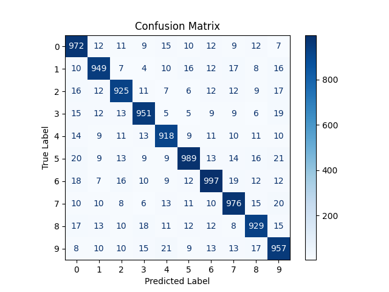

<table>
  <tr>
    <td width="50%" valign="top">
      <h3>🚨 Snapp CAPTCHA Security Flaws</h3>
      <div align="center">
        
      </div>
    </td>
    <td width="50%" valign="top">
      <h3>Introduction</h3>
      <p>While exploring the Snapp website, I investigated whether it was possible to log in without using a web browser or the official mobile app. My approach involved inspecting network requests to reverse-engineer authentication.</p>
      <p>During this process, I discovered a <b>security flaw</b> in Snapp's CAPTCHA implementation, allowing unrestricted automated requests. This Gist covers:</p>
      <ul>
        <li><b>Security flaws in Snapp's CAPTCHA</b></li>
        <li><b>Automating CAPTCHA solving using deep learning</b></li>
        <li><b>Solutions to improve CAPTCHA security</b></li>
      </ul>
    </td>
  </tr>
</table>


---

## 🔎 API Discovery and Analysis  

By inspecting network traffic, I identified Snapp's key authentication endpoints:

- **Base API URL:** `https://app.snapp.taxi/api`
- **Login Endpoint:** `https://app.snapp.taxi/login`
- **OTP Request Endpoint:** `https://app.snapp.taxi/api-passenger-oauth/v3/mutotp`
- **CAPTCHA Generation Endpoint:**  
  ```
  https://app.snapp.taxi/api/captcha/api/v1/generate/text/numeric/71C84A80-395B-448E-A240-B7DC939186D3
  ```

#### 🔹 Fetching CAPTCHA using `curl`
To retrieve and save the CAPTCHA directly using `curl`, run:
```bash
curl -s "https://app.snapp.taxi/api/captcha/api/v1/generate/text/numeric/71C84A80-395B-448E-A240-B7DC939186D3" | \
jq -r '.image' | cut -d ',' -f2 | base64 --decode > captcha.jpg
```

### 🛑 **Security Issue: Unrestricted CAPTCHA Generation**  
Each API request to the CAPTCHA endpoint **always returns a new CAPTCHA** without any session validation.  
- There is **no rate-limiting** or **session tracking**.  
- Attackers can **request unlimited CAPTCHAs** and use OCR to automate solving.  

Additionally, changing the URL parameter `numeric` to `alphabetic` generates different CAPTCHA types:
```
https://app.snapp.taxi/api/captcha/api/v1/generate/text/alphabetic/71C84A80-395B-448E-A240-B7DC939186D3
```

### 📌 Example of CAPTCHA API Request in Snapp  

```python
import requests
import base64
import os
import time

url = "https://app.snapp.taxi/api/captcha/api/v1/generate/text/numeric/71C84A80-395B-448E-A240-B7DC939186D3"

headers = {
    "Authorization": "Bearer your_token_here",
    "User-Agent": "Mozilla/5.0",
}

response = requests.get(url, headers=headers)

if response.status_code == 200:
    image_data = response.json().get("image").split(",")[1]
    image_bytes = base64.b64decode(image_data)

    if not os.path.exists("captcha"):
        os.makedirs("captcha")

    timestamp = int(time.time())
    with open(f"captcha/{timestamp}_captcha.jpg", "wb") as f:
        f.write(image_bytes)

    print(f"CAPTCHA saved: captcha/{timestamp}_captcha.jpg")
```

📌 **Problem:**  
- There is **no session restriction** on CAPTCHA generation.  
- Attackers can **bulk-collect CAPTCHA images** for model training.

---

## 🛠️ How to Improve Snapp's CAPTCHA Security  

### ✅ 1️⃣ Implement Session-Based CAPTCHA  

- Require a **session token** before generating CAPTCHA.
- Ensure CAPTCHA **expires** after use.

🔧 **How?**  
- Store CAPTCHA in session storage and prevent multiple requests per session.

```python
SESSION_CAPTCHAS = {}

def generate_captcha(session_id):
    if session_id in SESSION_CAPTCHAS:
        return SESSION_CAPTCHAS[session_id]  # Return existing CAPTCHA

    new_captcha = create_captcha_image()  # Generate new one
    SESSION_CAPTCHAS[session_id] = new_captcha
    return new_captcha
```

---

### ✅ 2️⃣ Enforce Rate Limiting  

- Restrict **CAPTCHA requests per IP**.
- Implement **progressive cooldowns** for repeated failures.

```python
from fastapi import FastAPI, Depends, Request, HTTPException
from slowapi import Limiter
from slowapi.util import get_remote_address

app = FastAPI()

# Set up rate limiting
limiter = Limiter(key_func=get_remote_address)

@app.get("/captcha")
@limiter.limit("5/minute")
async def generate_captcha(request: Request):
    return {"captcha": "generated_image"}

# Add middleware for rate limiting
from slowapi.middleware import SlowAPIMiddleware
app.add_middleware(SlowAPIMiddleware)

```

---

### ✅ 3️⃣ Strengthen CAPTCHA Complexity  

- Add **randomized distortions, variable fonts, and noise** to prevent OCR-based attacks.

---

## 🚀 Automating Snapp CAPTCHA Recognition  

To automate solving, I trained a **Convolutional Recurrent Neural Network (CRNN)** using PyTorch.  

### Model Performance  

- **Accuracy:** `0.998`
- **Confidence after 10 epochs:** `0.9981`
- **Compressed model size:** `30MB`  

### 📊 Confusion Matrices Across Training Epochs  

<table>
  <tr>
    <td></td>
    <td></td>
    <td></td>
  </tr>
  <tr>
    <td>Epoch 1</td>
    <td>Epoch 5</td>
    <td>Epoch 10</td>
  </tr>
</table>

---

## 🏗️ CAPTCHA Recognition Pipeline  

| Step | Description | Command |
|------|------------|---------|
| 🏷 **Fetching CAPTCHA** | Calls Snapp’s CAPTCHA API, saves the image, and runs OCR model for prediction. | ```bash python snapp_captcha_getter.py ``` |
| 🔐 **Automating Login** | Submits a login request, uses CAPTCHA prediction for authentication, and automates the login process. | ```bash python snapp_going_inside.py ``` |


---

## 🧠 **Deep Learning Model Architecture (CRNN)**  

### **1️⃣ Convolutional Feature Extraction**  
- **5 Convolutional Layers** (3x3 kernels, ReLU activations).  
- **Batch Normalization & MaxPooling** for better generalization.  
- **Dropout** to prevent overfitting.  

### **2️⃣ Recurrent Sequence Processing**  
- **BiLSTM** (Bidirectional Long Short-Term Memory) for sequence prediction.  
- **Linear Layer Projection** to character logits.  
- **Log Softmax Activation** for probability distributions.  

### **3️⃣ CTC Loss for Sequence Learning**  
- Eliminates the need for predefined segmentation.  

```python
import torch.nn as nn

class CRNN(nn.Module):
    def __init__(self):
        super(CRNN, self).__init__()
        self.cnn = nn.Sequential(
            nn.Conv2d(1, 64, 3, padding=1), nn.ReLU(),
            nn.MaxPool2d(2, 2),
            nn.Conv2d(64, 128, 3, padding=1), nn.ReLU(),
        )
        self.rnn = nn.LSTM(128, 256, bidirectional=True, batch_first=True)
        self.fc = nn.Linear(512, 10)  # Output: 10 digits

    def forward(self, x):
        x = self.cnn(x)
        x, _ = self.rnn(x)
        return self.fc(x)
```

---

## ⚠️ Ethical Considerations  

This project was conducted **for research purposes only**. Unauthorized CAPTCHA bypassing **may violate legal policies and terms of service**. **Use responsibly.**  

### 🔥 **Summary**  

✅ Snapp CAPTCHA is vulnerable to **automation attacks**.  
✅ By implementing **session-based validation, rate limiting, and stronger CAPTCHAs**, Snapp can **enhance security**.  
✅ Deep learning-based OCR **can easily break static CAPTCHAs**.  

---

#CyberSecurity #Snapp #MachineLearning #Automation  
